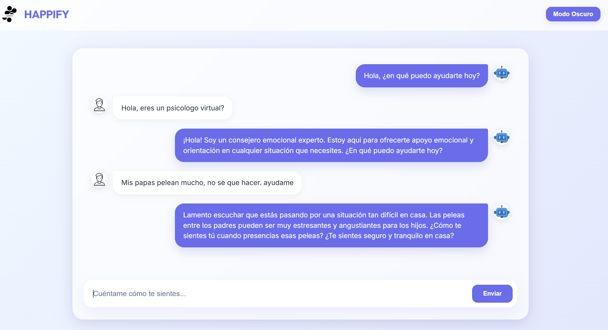

# Happify - Tu Asistente Emocional con IA

Happify es una aplicación web moderna diseñada para ofrecer apoyo emocional y consejos prácticos utilizando la inteligencia artificial de OpenAI. Con una interfaz premium basada en **Glassmorphism**, Happify proporciona un entorno tranquilo y profesional para que los usuarios expresen sus sentimientos.

## Contexto del Proyecto

Este proyecto fue desarrollado originalmente en **2023** como parte del curso **Introducción a la Ingeniería de Sistemas** de la **Universidad de los Andes**. Fue presentado en **Expo Andes** como el proyecto de semestre de estudiantes de primer semestre, destacando el uso de tecnologías emergentes para el bienestar social.

## Vista Previa



## Características

- **IA Avanzada:** Integración con OpenAI (GPT-3.5 Turbo) configurado como consejero emocional experto.
- **Diseño Premium:** Interfaz elegante con efectos de cristal (Glassmorphism), fuentes modernas (Outfit & Inter) y animaciones fluidas.
- **Modo Oscuro:** Cambia entre tema claro y oscuro con un solo clic para mayor comodidad visual.
- **Responsive:** Totalmente optimizado para dispositivos móviles y escritorio.
- **Seguro:** Gestión de claves API mediante variables de entorno (.env).

## Cómo Ejecutar el Proyecto

### 1. Requisitos Previos
Asegúrate de tener Python instalado en tu sistema.

### 2. Configuración de API Key
1. Localiza el archivo `.env` en la carpeta raíz.
2. Abre el archivo y añade tu clave de OpenAI:
   `OPENAI_API_KEY=tu_clave_aqui`

### 3. Instalación de Dependencias
Abre una terminal en la carpeta del proyecto y ejecuta:
```bash
pip install flask flask-cors openai python-dotenv
```

### 4. Lanzar la Aplicación
Ejecuta el servidor con el siguiente comando:
```bash
python chatbot.py
```

### 5. Acceder al Chat
Abre tu navegador y dirígete a:
**[http://127.0.0.1:5000](http://127.0.0.1:5000)**

---

## Tecnologías Usadas
- **Backend:** Flask (Python)
- **Frontend:** HTML5, CSS3 (Vanilla), JavaScript
- **IA:** OpenAI API
- **Estilos:** Glassmorphism UI Design

Creado con ❤️ para el bienestar emocional.
